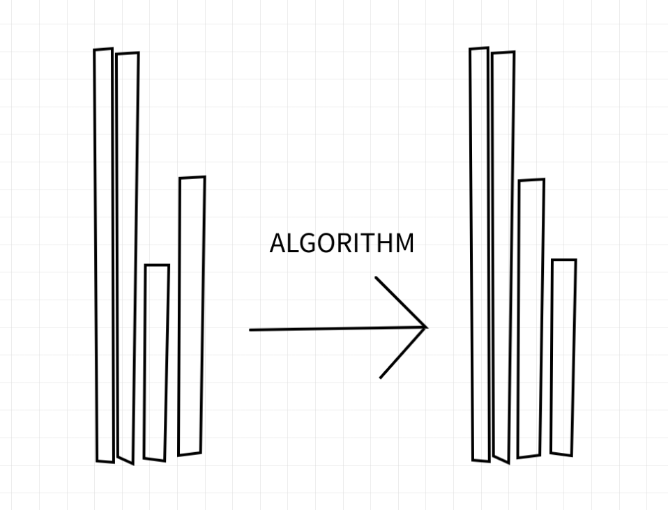
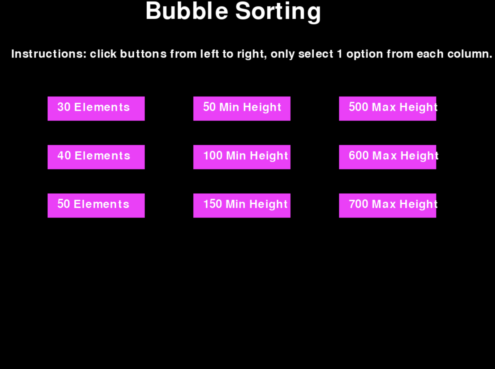

:warning: Everything between << >> needs to be replaced (remove << >> after replacing)

# << SORTING ALGORITHM >>
## CS110 Final Project  << Semester 1, Year 2023>>

## Team Members

<< List team member names >>

Sammy Haridy, Andrew Chen

## Project Description

<< Give an overview of your project >>

A sorting algorithm with vertical bars displayed on the GUI, a sorting alogorithm on python will organize these bars based on length.    

## GUI Design

### Initial Design

### Final Design

## Program Design

### Features

1. Nine pressable buttons
2. Customizable amount of rectangles to sort
3. Customizable minimum height and maximum height of rectangles to sort
4. Bar sorting animation with red highlighting rectangles to be swapped
5. Stopwatch recording how long it takes for the program to run

### Classes

- Controller: The only class in the code. Within it are several methods. Def init contains all the starter code and variables. Def mainloop runs the methods in the class like bubble sort and update display. Def handle menu clicks contains all the code for pressing the buttons on the menu screen. Def draaw menu displays it on the screen.

## ATP

1. Click on the "10 Elements" box on the far left. Result: The "10 Elements" box will turn light purple. 
2. Click on the "50 Min Height" box on the far left. Result: The "50 Min Height" box will turn light purple. 
3. Click on the "500 Max Height" box on the far left. Result: The "500 Max Height" box will turn light purple. 10 rectangles with random lengths varying from 50 to 500 will show up on the screen. The rectangles will sort themselves shortest to longest, left being shortest. The time to sort will be displayed on the screen. 

